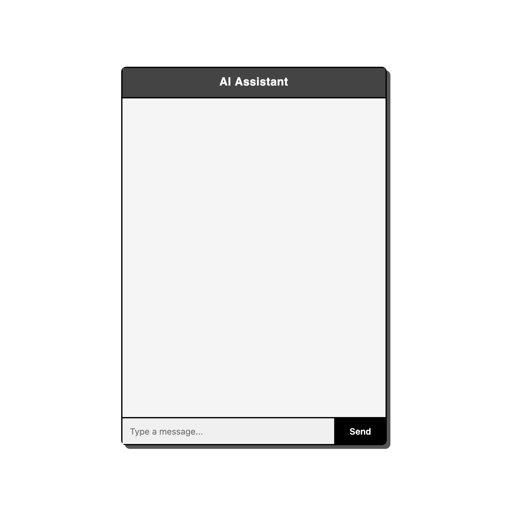
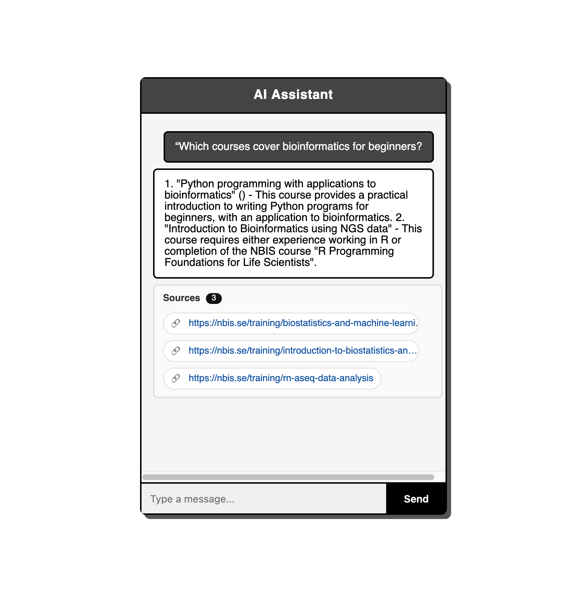

# **Flask RAG Application**

## **Introduction**

This RAG application is designed to make it easier to explore the **NBIS Training Catalogue** (https://nbis.se/training).  
It automatically parses all available courses from the NBIS website, indexes their details (title, description, outcomes, etc.), and allows users to ask **natural language questions** about the training opportunities.  

For example, users can ask:  
- *“Which courses cover bioinformatics for beginners?”*  
- *“Are there any workshops on data analysis in October?”*  
- *“What courses focus on single-cell genomics?”*  

Instead of manually browsing the course catalogue, the system retrieves the most relevant information and generates **context-aware answers** using a local LLM.  

## **Tech Stack**

This project is a **Retrieval-Augmented Generation (RAG)** application built with **Flask**, **LangChain**, and **Ollama**. It extracts course data from web pages, indexes it into a vector database, and allows users to query relevant training courses with natural language questions.

The pipeline works as follows:

1. **Data Extraction** → Scrapes course data (title, description, outcomes, etc.) into structured JSON.  
2. **Vector Database Creation** → Splits and embeds the extracted text using **Ollama embeddings**, stored in a **Chroma / FAISS** vector database.  
3. **Query & Retrieval** → User queries are embedded and matched against the vector DB for the most relevant results.  
4. **Answer Generation** → A local Ollama LLM (**Mistral**) generates a contextual response with course recommendations.

## **Getting Started**

### **1\. Clone the repo**

```
git clone git@github.com:adeel-ahmad-awan/CourseRAG.git
cd CourseRAG
```


### **2\. Install Dependencies**

Make sure you have Python 3.9+ installed.

It’s recommended to use a virtual environment to keep dependencies isolated:


```
# Create virtual environment (Linux/Mac)
python3 -m venv venv

# Or on Windows
python -m venv venv

# Activate the environment
# Linux/Mac
source venv/bin/activate
# Windows (PowerShell)
venv\Scripts\activate
```
Then install required packages:

```
pip install -r requirements.txt
```

### **3. Install & Run Ollama**

This app uses [**Ollama**](https://ollama.ai/) to run local LLMs and generate embeddings.  

Make sure Ollama is installed and running on your system. By default, Ollama serves models at **http://localhost:11434/**, so ensure the service is up before continuing.


Download the required models:

```
ollama pull mistral
ollama pull nomic-embed-text
```
By default, the app is configured to use:  
- **nomic-embed-text** → for creating embeddings  
- **mistral** → as the main language model for generating responses


### **4\. Extract Course Data**

Scrape course pages and save them into app/data/course\_data.json:

```
python app/utils/data_extractor.py
```

### **5\. Build Vector Database**

Create embeddings and store them in **Chroma**:

```
python app/utils/create_vector_db.py
```

### **6\. Run the Flask App**

Start the Flask server and access the chat interface:

```
python run.py
```
* Open a browser and go to: http://127.0.0.1:5000
* Type your questions in the chat interface; answers are generated using the RAG pipeline.

## **Screenshots**

### Home / Chat Interface


### Example Query
Ask: *“Which courses cover bioinformatics for beginners?”*  


